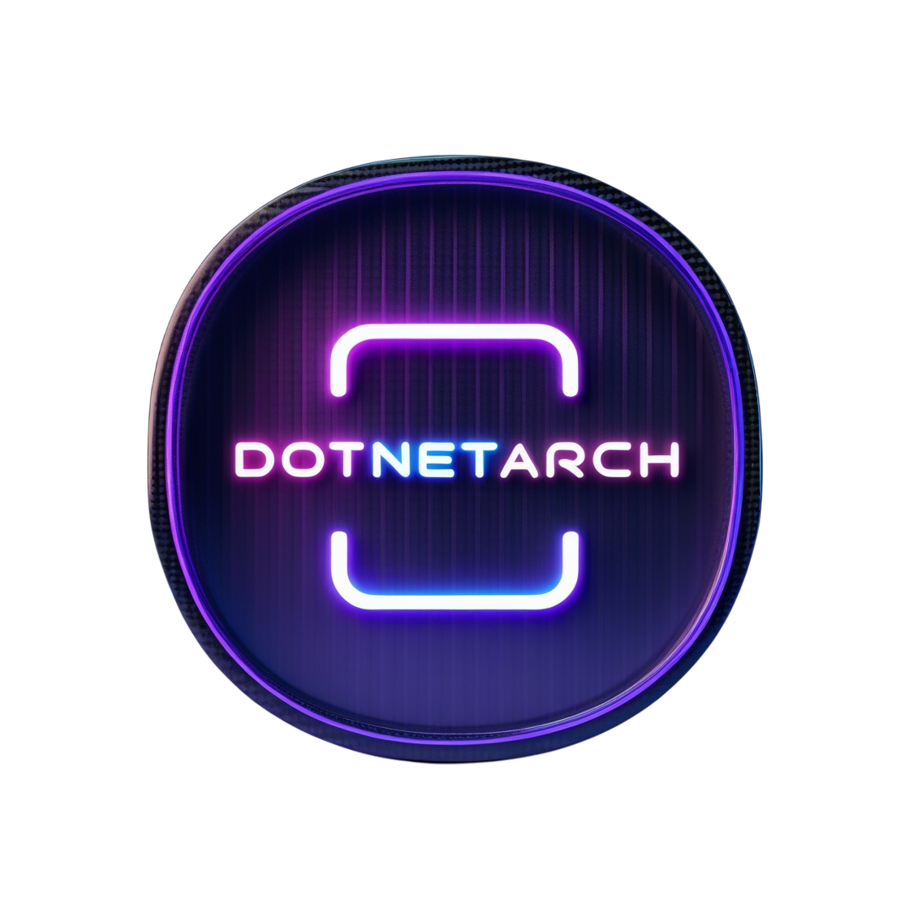

[English](./README.md)



# DotNetArch

یک ابزار گلوبال چندسکویی دات‌نت (`dotnet-arch`) که **میکروسرویس‌های Clean Architecture**، **kitهای مستقل مبتنی بر provider** تولید می‌کند و خودش را به‌عنوان **سرور MCP** برای agentها در دسترس می‌گذارد.

---

## فهرست
- [چه چیزی تولید می‌کند](#چه-چیزی-تولید-می‌کند)
- [نیازمندی و نصب](#نیازمندی-و-نصب)
- [شروع سریع](#شروع-سریع)
- [مرجع دستورها](#مرجع-دستورها)
- [ساختار میکروسرویس تولیدشده](#ساختار-میکروسرویس-تولیدشده)
- [مدل پیکربندی](#مدل-پیکربندی)
- [Kitها](#kitها)
- [Docker، Git، CI و registry شخصی](#docker-git-ci-و-registry-شخصی)
- [MCP](#mcp)
- [تست‌ها](#تستها)
- [ساخت از سورس](#ساخت-از-سورس)
- [نقشهٔ مستندات](#نقشهٔ-مستندات)

## چه چیزی تولید می‌کند
| دستور | خروجی |
| --- | --- |
| `new solution` | پروژه‌های Domain / Application / Infrastructure / Api با DI جدا برای هر لایه، مدیریت مرکزی نسخهٔ پکیج، بارگذاری پیکربندی، تست هر لایه و به‌دلخواه Docker، Git، CI، host ‏MCP، قواعد agent و spec |
| `new crud`، `new action`، `new event`، `new enum`، `new constant` | یک vertical slice به‌ازای هر entity (command، query، action، event، DTO، validator، نگاشت EF، controller یا endpoint، تست، ابزار MCP) |
| `new service` | سرویس Application اگر منطق کسب‌وکار دارد، یا **kit** اگر قابلیت خارجی است |
| `new kit` / `add kit` | `kits/<Area>`: ‏Abstractions و Core و providerها، وصل‌شده به solution |
| `mcp serve` | سرور MCP روی stdio؛ هر دستور رجیستری یک ابزار با همان نام و همان مقدارهاست |
| `add layer`، `add tests`، `spec list\|add\|check`، `graph` | افزودن لایهٔ ABP فقط وقتی محتوا دارد، پروژهٔ تست یک لایه، مدیریت اسپک، گراف پروژه |

کد تولیدشده Clean Architecture، ports و adapters، vertical slice با CQRS ‏(MediatR)، unit of work و repository، SOLID و Clean Code را رعایت می‌کند، در Release بدون warning build می‌شود و تست‌های خودش را دارد.

## نیازمندی و نصب
- [.NET SDK](https://dotnet.microsoft.com/download) نسخهٔ 8 یا بالاتر، Git؛ Docker اختیاری است.
```bash
dotnet tool install --global DotNetArch      # یا: dotnet tool update --global DotNetArch
dotnet-arch --help
```

## شروع سریع
```bash
dotnet-arch new solution Shop --database=Postgres --mcp --ci=auto --git-remote=git@github.com:acme/shop.git
cd Shop
dotnet-arch new crud --entity=Product
dotnet-arch new action --entity=Product --action=Archive --method=POST
dotnet-arch new event --entity=Product --name=Created
dotnet-arch new service --logic=false --area=Cache --providers=InMemory,Redis   # قابلیت خارجی = kit
cp src/Shop.Api/.env.example src/Shop.Api/.env                                  # secretها و مقادیر runtime
dotnet run --project src/Shop.Api
```
گزینه‌های جاافتاده در حضور ترمینال پرسیده می‌شوند (با پیش‌فرض)؛ با ورودی pipe شده با شمارهٔ گزینه یا متن پاسخ دهید و خط خالی یعنی پیش‌فرض.

## مرجع دستورها
| دستور | کاربرد |
| --- | --- |
| `new solution <Name>` | ساخت solution. گزینه‌ها: `--output`، `--database=SQLite|SqlServer|Postgres`، `--style=controller|fast`، `--layout=v2|legacy`، `--mcp`، `--ci=auto|none|github|gitlab|azure|bitbucket|gitea`، `--git-remote`، `--git-provider`، `--git-host`، `--docker-registry`، `--nuget-source`، `--nuget-source-name`، `--no-docker`، `--no-git`، `--no-tests` |
| `new crud --entity=X` | slice کامل CRUD (`--no-migration` ساخت migration را رد می‌کند) |
| `new action --entity=X --action=Name --method=...` | use case سفارشی |
| `new event --entity=X --name=Name` | رویداد دامنه و افزودن subscriber |
| `new enum` / `new constant` | enum یا ثابت‌ها، مخصوص entity یا مشترک |
| `new service` | سرویس کسب‌وکار یا kit. غیرتعاملی: `--logic=true --name=` یا `--logic=false --area= [--providers=]` |
| `new kit --area=Cache [--providers=A,B] [--kit-prefix=P] [--with-tests]` | ساخت kit مستقل و وصل کردن آن |
| `add kit <Area>` / `add mcp` | وصل kit موجود / افزودن host ‏MCP |
| `ci add` / `docker add` / `git setup` | فایل‌های عملیاتی برای solution موجود |
| `exec [--docker|--docker-detach|--docker-stop]` | اجرای API محلی یا در Docker (ابتدا migrationها اعمال می‌شود) |
| `remove migration` | بازگرداندن و حذف آخرین migration |
| `doctor [path] [--profile=file] [--json] [--strict]` | تشخیص فقط‌خواندنی ریپوی موجود (لایه‌ها، وابستگی‌ها، تست و پوشش، پیکربندی/secret، Docker/CI، مستندات، قواعد کد، مرز kitها، قواعد پروفایل)؛ در حالت مسدودکننده کد خروج ۳ |
| `adopt [path] [--profile=file] [--apply]` | پروژهٔ موجود را تحت کنترل می‌آورد: فقط `.net-arch/` را می‌نویسد (state از روی سورس). اول طرح |
| `fix [path] [--rules=ids] [--apply]` | اصلاحات مکانیکی بهداشتی (global.json، .editorconfig، خط‌های .gitignore، .dockerignore). هرگز کد را ویرایش نمی‌کند. اول طرح |
| `mcp serve` | شروع سرور MCP روی stdio |

کد خروج: `0` موفق، `1` خطای استفاده/اعتبارسنجی، `2` نبودن .NET SDK. همهٔ نام‌ها پیش از رسیدن به فایل‌سیستم یا خط فرمان اعتبارسنجی می‌شوند و فرایندهای فرزند بدون shell اجرا می‌شوند.

## ساختار میکروسرویس تولیدشده
```text
Shop/
├── src/
│   ├── Shop.Domain            entityها (setter خصوصی، رفتار)، رویدادها، enumها، ثابت‌ها
│   ├── Shop.Application       پورت‌ها، Features/<Plural>/{Commands,Queries,Actions,Events,Dtos,Services}/<UseCase>/، validatorها
│   ├── Shop.Infrastructure    EF Core، repository، unit of work، بارگذاری پیکربندی
│   ├── Shop.Api               controller (یا endpointهای minimal API)، composition root
│   └── Shop.Mcp               host اختیاری MCP
├── kits/                      kitهای مستقل (Abstractions / Core / Providers.*)
├── tests/                     یک پروژهٔ تست برای هر لایه
├── docs/                      spec، roadmap، دفتر تصمیم (انگلیسی و فارسی)
├── AGENTS.md  Directory.Build.props  Directory.Packages.props  global.json
├── docker-compose.yml  فایل CI  NuGet.config (با feed شخصی)  dotnet-arch.yml
```
وابستگی‌ها به داخل است (`Api/Mcp -> Infrastructure -> Application -> Domain`). هر لایه سرویس‌های خودش را ثبت می‌کند و فقط پکیج‌های خودش را دارد. repositoryها async‌اند و `IQueryable` را بیرون نمی‌دهند.

## مدل پیکربندی
- **appsettings.json** مقادیر غیرحساس؛ **environment و `.env`** برای secret و مقادیر runtime (UPPER_CASE با زیرخط تکی؛ `__` برای تودرتویی).
- یک مرحله (`AddAppConfiguration()`) پیش از هر options binding: appsettings، appsettings.{Env}، `.env`، `.env.{env}`، environment واقعی، خط فرمان (بعدی غالب است).
- `.env.example` و `appsettings.example.json` تولید می‌شوند و با تست‌ها (`Category=Configuration` و `scripts/validate-examples.sh`) کنترل می‌شوند؛ `ConfigurationContract` همهٔ کلیدهای secret را فهرست می‌کند.

## Kitها
قابلیت‌های خارجی به‌صورت kit بسته‌بندی می‌شوند و نام آن‌ها بر اساس قابلیت است نه محصول: `MediaStorage` (Minio، RustFs)، `Cache` (InMemory، Redis)، `MessageBroker` (RabbitMq) یا هر حوزهٔ جدید.
`Providers.* -> Core -> Abstractions`: Application فقط Abstractions را می‌شناسد و composition root به Core و providerها ارجاع می‌دهد. provider با `Cache:Provider` انتخاب می‌شود. هر kit نسخه و pack و انتشار جدا دارد (`scripts/pack-kits.sh`، job در CI با `--nuget-source`). پیاده‌سازی providerها با stub راستی‌آزمایی شده‌اند نه با سرور واقعی.

## Docker، Git، CI و registry شخصی
- Dockerfile چندمرحله‌ای (restore کش‌شده، کاربر غیر root)، `.dockerignore` و `docker-compose.yml` مطابق پایگاه داده.
- pipeline برای GitHub Actions، GitLab CI، Azure Pipelines، Bitbucket Pipelines یا Gitea Actions؛ انتخاب خودکار از git remote (`--ci=auto`) یا صریح؛ سرور شخصی با `--git-provider` و `--git-host`.
- `--docker-registry` و `--nuget-source` نام ایمیج‌ها، login و push در CI، `NuGet.config` و restore در Dockerfile را تنظیم می‌کنند. credential هرگز در فایل نوشته نمی‌شود؛ secretهای CI فقط با نام ارجاع می‌شوند.

## MCP
- **سرور ابزار**: `dotnet-arch mcp serve` (stdio) با ۱۸ ابزار غیرتعاملی (`new_solution`، `new_crud`، `new_service`، `new_kit`، `add_mcp`، `doctor`، `adopt`، `fix`، ...)؛ هر نتیجه فایل‌های ساخته/تغییرکرده و فرمان CLI معادل را می‌دهد؛ ابزار مخرب ندارد.
```json
{ "mcpServers": { "dotnet-arch": { "command": "dotnet-arch", "args": ["mcp", "serve"] } } }
```
- **host تولیدشدهٔ MCP** (`--mcp` یا `add mcp`): ‏`src/<App>.Mcp` با HTTP روی `/mcp` و bearer token ‏`MCP_AUTH_TOKEN`؛ ابزارهای هر entity و action همان درخواست‌های MediatR را می‌فرستند که controllerها می‌فرستند.

## تست‌ها
`dotnet test` در solution تولیدشده تست‌های هر لایه را اجرا می‌کند. خود ابزار تست‌های واحد برای Core و Cli و Mcp و تست‌های یکپارچه (تولید golden، پروتکل MCP) دارد که `scripts/smoke.sh` اجرا می‌کند.

## چیدمان قدیمی
solutionهای ساخته‌شده پیش از نسخهٔ 1.3 (چیدمان تخت `<App>.Core/Application/Infrastructure/API` و بدون کلید `layout:`) با همهٔ دستورها کار می‌کنند و `new solution --layout=legacy` همان شکل را می‌سازد.

## ساخت از سورس
```bash
dotnet build DotNetArch.sln
dotnet test DotNetArch.sln --filter "Category!=Integration"
scripts/smoke.sh
dotnet run --project src/DotNetArch.Cli -- new solution Demo
```

## نقشهٔ مستندات
`docs/specs/` (نیازمندی‌ها، معماری، قراردادها، پذیرش، مرور، changelog، `openspec.yaml`، `testspec.yaml`)، `docs/decisions/`، `docs/ROADMAP.md` و `AGENTS.md`. نسخه‌های فارسی `.fa.md` هستند و `scripts/check-docs.sh` جفت‌ها را بررسی می‌کند.

## مشارکت و مجوز
ابتدا `CONTRIBUTING.md` و `AGENTS.md` را بخوانید. مجوز MIT (`LICENSE`). نگهدارنده: Moein Rezaee.
