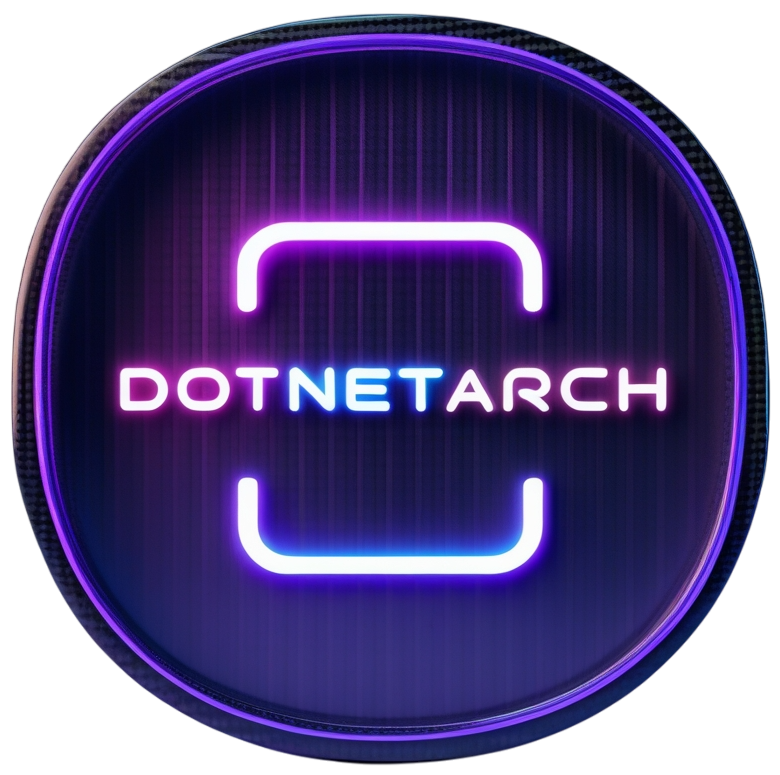

# DotNetArch

A cross-platform .NET global tool that bootstraps opinionated Clean Architecture solutions with Domain-Driven Design in seconds.

---

## Table of Contents
- [Introduction](#introduction)
- [Solution Structure](#solution-structure)
- [Features](#features)
- [Requirements](#requirements)
- [Installation](#installation)
- [Quick Start](#quick-start)
- [Command Reference](#command-reference)
  - [new solution](#new-solution)
  - [new crud](#new-crud)
  - [new action](#new-action)
  - [new event](#new-event)
  - [new enum](#new-enum)
  - [new constant](#new-constant)
  - [new service](#new-service)
  - [exec](#exec)
  - [remove migration](#remove-migration)
- [Contributing](#contributing)
- [Roadmap](#roadmap)
- [License](#license)
- [Contact](#contact)

## Introduction
DotNetArch removes the friction of setting up a well-structured .NET application. The tool generates a fully wired solution with clearly separated layers, ready-made infrastructure, and sensible defaults so you can focus on your domain from day one.

## Solution Structure
```text
MyApp/
├── MyApp.Core/
├── MyApp.Application/
├── MyApp.Infrastructure/
├── MyApp.API/
│   └── Config/
│       ├── Env/
│       │   ├── .env.development
│       │   ├── .env.test
│       │   └── .env.production
│       └── Settings/
│           ├── appsettings.development.json
│           ├── appsettings.test.json
│           └── appsettings.production.json
├── Dockerfile
├── docker-compose.yml
├── dotnet-arch.yml
└── README.md
```
This layout exposes all the moving parts up front—application layers, environment configs, and Docker assets.

## Features
- **One-command solution scaffolding** with Core, Application, Infrastructure, and API layers—choose **controller** or **fast** minimal APIs.
- **Git & docs bootstrap**: initializes a repository, adds a `.gitignore`, and drops in a README template.
- **Docker-friendly**: generates Dockerfile and `docker-compose.yml`; `exec --docker` builds images, starts containers, streams logs, and cleans everything up safely on exit.
- **Detached Docker lifecycle**: `exec --docker-detach` runs containers in the background with step-by-step logging, and `exec --docker-stop` safely stops and removes them when you're done.
- **Environment-specific configuration**: prepopulated `.env` and `appsettings` files for development, test, and production under `API/Config`.
- **Vertical-slice CRUD generation** using MediatR, FluentValidation, and Unit-of-Work based EF Core repositories with pagination helpers.
- **Unit-of-Work repositories** are created automatically so your data layer is production-ready from the start.
- **Custom action scaffolding** for additional commands or queries without breaking existing slices.
- **Event scaffolding** to create domain events and interactively wire subscribers across features.
- **Enum scaffolding** to generate strongly typed enumerations per feature or globally under `Core/Common/Enums`.
- **Service scaffolder** for custom services, Redis caches, RabbitMQ message brokers, or outbound HTTP clients with resilient `HttpRequest` wrappers and automatic DI registration.
- **Database provider selection** (SQL Server, SQLite, PostgreSQL, or MongoDB) stored for reuse across commands.
- **Idempotent updates**: running commands again augments existing files instead of duplicating them.
- **Automatic NuGet package and service registration**, including Swagger and startup configuration.
- **Exec command auto-migrates**: detects property changes, creates missing migrations, applies them, and then runs the API or Docker container.
- **Cross-platform** and tested on Windows, macOS, and Linux.

## Requirements
- [.NET SDK](https://dotnet.microsoft.com/download) **6.0+** (recommended: 8.0)
- Supported OS: Windows 10+, macOS Catalina+, or any modern Linux distribution
- [Git](https://git-scm.com/) for cloning or contributing

Check your .NET version:
```bash
dotnet --version
```

## Installation
Install or update the tool globally from NuGet:
```bash
dotnet tool install --global DotNetArch
# or
 dotnet tool update --global DotNetArch
```

## Quick Start
Generate a new solution, scaffold an entity, and run the API:
```bash
dotnet-arch new solution MyApp
cd MyApp
# optional: choose API style, startup project, and database provider interactively
# env and appsettings for dev/test/prod are under ./config

dotnet-arch new crud --entity Product
# creates controllers/endpoints, unit-of-work repository, handlers, validators, and migrations

dotnet-arch new event --entity Product --event Created
# scaffolds ProductCreatedEvent and lets you add subscribers

dotnet-arch new enum --entity Product --enum Status
# creates Status enum under Core/Features/Products/Enums

dotnet-arch new enum --enum Priority
# creates Priority enum under Core/Common/Enums

dotnet-arch new constant --entity Product --constant Fields
# creates Fields class under Core/Features/Products/Constants

dotnet-arch new constant --constant AppSettings
# creates AppSettings class under Core/Common/Constants

dotnet-arch new service
# choose "HttpRequest" to generate a typed HTTP client wrapper

dotnet-arch exec --docker
# builds an image, starts a container, auto-applies migrations, and cleans it up on exit

dotnet-arch exec --docker-detach
# builds an image, starts a container in the background, logs setup steps, and leaves it running

dotnet-arch exec --docker-stop
# safely stops and removes the detached container and image
```
Missing options are prompted with sane defaults, keeping the experience smooth for newcomers.

## Command Reference
### new solution
```bash
dotnet-arch new solution <SolutionName> [--output=Path] [--startup=ProjectName] [--style=controller|fast]
```
Creates a clean, feature-based solution. Initializes Git, writes a README template, scaffolds `.env` and `appsettings` files for development, test, and production, optionally adds Docker assets, and records choices in `dotnet-arch.yml` for later commands.

### new crud
```bash
dotnet-arch new crud --entity=EntityName [--output=Path]
```
Generates a full vertical slice for an entity with CQRS handlers, validators, Unit-of-Work repositories, API endpoints, and migrations. Re‑runs update existing files.

### new action
```bash
dotnet-arch new action --entity=EntityName [--action=ActionName] --method=METHOD [--output=Path]
```
Adds a custom command or query to an existing slice. After choosing the HTTP verb, you're prompted for an optional action name—leaving it blank infers a CRUD-style name from the method. The scaffolder infers command versus query based on the HTTP verb. If the slice is missing, a minimal repository and controller are created.

### new event
```bash
dotnet-arch new event --entity=EntityName [--event=EventName] [--output=Path]
```
Creates a domain event for an entity and interactively adds subscribers from other slices.

### new enum
```bash
dotnet-arch new enum [--entity=EntityName] --enum=EnumName [--output=Path]
```
Creates an enum for an existing entity under `Core/Features/<Entity>/Enums`. If no entity is supplied, the enum is placed in `Core/Common/Enums`.

### new constant
```bash
dotnet-arch new constant [--entity=EntityName] --constant=ConstantName [--output=Path]
```
Creates a constants class for an existing entity under `Core/Features/<Entity>/Constants`. If no entity is supplied, the class is placed in `Core/Common/Constants`.

### new service
```bash
dotnet-arch new service [--output=Path]
```
Interactive scaffolding for:
- **Custom services** (per‑feature or common)
- **Cache services** powered by Redis
- **Message broker services** using RabbitMQ
- **HttpRequest service wrapper** for calling external APIs

Interfaces and implementations are placed in the appropriate layer and registered automatically.

### exec
```bash
dotnet-arch exec [--output=Path] [--docker] [--docker-detach] [--docker-stop]
```
Launches the startup project. Detects entity property changes, creates and applies migrations automatically, and then runs the API. With `--docker`, builds the image, starts the container, streams logs, and tears everything down safely on exit. With `--docker-detach`, performs the same setup with step-by-step logging but leaves the container running in the background without streaming logs or cleaning up. With `--docker-stop`, safely stops and removes the container and image from a detached run.

### remove migration
```bash
dotnet-arch remove migration [--output=Path]
```
Rolls the database back one migration and deletes the last migration file without running the application.

## Contributing
Contributions are welcome! To get started:
1. **Fork** the repository and create a branch: `git checkout -b feature/awesome-thing`
2. **Build** to ensure everything compiles: `dotnet build`
3. **Commit** your changes following conventional commits if possible
4. **Push** and open a pull request

Please open an issue for large features to discuss your proposal first.

## Roadmap
- Support for additional architectural styles (microservices, event-driven)
- Extended template customization options
- Deeper integrations with libraries like MassTransit
- Optional GUI for non-CLI users

## License
[MIT](LICENSE)

## Contact
- **GitHub Issues**: [Report a problem](https://github.com/moein-rezaee/DotNetArch/issues)
- **Email**: me.rezaei1996@gmail.com
- **LinkedIn**: [Moein Rezaee](https://linkedin.com/in/moein-rezaee-26331a125)

Start simplifying your .NET project setup today with **DotNetArch**! 🚀
